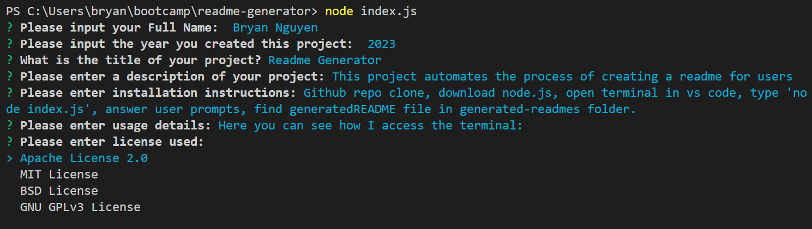

# ReadMe-Generator

## Description 

This is a readme generator, this is a tool to automate a users life and make creating and populating readme's efficient and productive. Users will get prompted with questions using node.js that will then populate into the readme. This generator uses the inquirer package in order to prompt users with questions that will then be stored and generated in a dynamic function that generates the markdown file with the user inputs.

## Mock-Up

The following image shows an example of a generated readme through this application:


## Table of Contents

* [Installation](#installation)
* [Code Example](#code-example)
* [Usage](#usage)
* [Learning Points](#learning-points)
* [Author Info](#author-info)
* [Credits](#credits)
* [License](#license)

## Installation

1. Clone down the repository or download all files within repository
2. You will need to install node.js
3. Open terminal within VS Code and type 'node index.js'
4. Enter your inputs as you wish
5. Find your generatedREADME.md under generated-readmes folder, and download it or upload it to your project as you wish.


## Code Example

Here is an example of my functions within my index.js that allow users to get prompted using the inquirer package, and saving those answers and importing and exporting them into my generateMarkdown function from my generateMarkdown.js and how it writes to the file after it has processed all user inputs and makes a file and/or directory based on if the user has the directory already or not.

```javascript
function userPrompt(){
    inquirer.prompt(questions)
    .then((answers) => {
        console.log('You typed: ', answers);
        writeToFile("./generated-readmes/generatedREADME.md", markdown.generateMarkdown(answers));
    });
}

function writeToFile(fileName, data) {
    const dir = './generated-readmes';

    if (!fs.existsSync(dir)) {
        fs.mkdirSync(dir);
    }

    fs.writeFile(fileName, data, (error) => {
        if (error) throw error;
        console.log(`File ${fileName} has been saved!`);
    });
}

```

## Usage

Here is a video link to show what a user might encounter when using the readme generator properly:
[Example Application Usage](https://watch.screencastify.com/v/8IJRy6DFkgXexq2oft9Z)

Here you can see how I access the terminal within VS Code:


Here you can see what I input into the terminal to initalize the application:


Here you can see the list of prompts the user can then input by typing or selecting if it is a list:



Here you can see after finishing the prompts the users inputs are console logged then a message stating whether or not the generated readme was generated and saved happened:


Here is the finished readme with all user inputs populated into the proper sections:


## Learning Points 

This was a really fun task in my opinion. I believe automation and making daily monotonous tasks easier and more efficient is something I truly believe in. This project taught me a lot about using node.js and export import methodology. It also taught me certain aspects of Object-Oriented Programming as well as using the inquirer package which was something that was completely new to me. There was not very many stopping points for me but definitely more to improve on in the future. I want more prompt questions so if users want to they are able to be more specific as to what category they want to choose from and then get a set of questions based on their wants in their readme.

## About Me

Hi, my name is Bryan Nguyen I am an up and coming full-stack web developer working
on getting into the space with projects that support both my growth, belief, and imagination. I hope to one day work within the realm of AI, web-development, and even site-reliability/cyber-security.

## My links

* [Portfolio](https://bryannguyen9.github.io/Bryan-Nguyen-Portfolio/)
* [LinkedIn](https://linkedin.com/in/bryannguyen9)
* [Github](https://github.com/bryannguyen9)


## Credits

### Special thanks to David Chung: 
 
 * His Github Portfolio: [David-Chung-Github](https://github.com/dchung13/)
 * His Linked-In: [David-Chung-LinkedIn](https://www.linkedin.com/in/david-chung-77141526b/)
 * His Portfolio Site: [David-Chung-Portfolio](https://dchung13.github.io/David-Chung-Portfolio/) 

### Special thanks to these reference websites that taught me different functionalities within my website for me to create a seamless experience for users.

1. [Choosealicense](https://choosealicense.com/licenses/)
2. [gist.github](https://gist.github.com/lukas-h/2a5d00690736b4c3a7ba)
3. [javascript.io](https://javascript.plainenglish.io/how-to-inquirer-js-c10a4e05ef1f)

## License

MIT License

Copyright (c) [2023] [Bryan-Nguyen]

Permission is hereby granted, free of charge, to any person obtaining a copy
of this software and associated documentation files (the "Software"), to deal
in the Software without restriction, including without limitation the rights
to use, copy, modify, merge, publish, distribute, sublicense, and/or sell
copies of the Software, and to permit persons to whom the Software is
furnished to do so, subject to the following conditions:

The above copyright notice and this permission notice shall be included in all
copies or substantial portions of the Software.

THE SOFTWARE IS PROVIDED "AS IS", WITHOUT WARRANTY OF ANY KIND, EXPRESS OR
IMPLIED, INCLUDING BUT NOT LIMITED TO THE WARRANTIES OF MERCHANTABILITY,
FITNESS FOR A PARTICULAR PURPOSE AND NONINFRINGEMENT. IN NO EVENT SHALL THE
AUTHORS OR COPYRIGHT HOLDERS BE LIABLE FOR ANY CLAIM, DAMAGES OR OTHER
LIABILITY, WHETHER IN AN ACTION OF CONTRACT, TORT OR OTHERWISE, ARISING FROM,
OUT OF OR IN CONNECTION WITH THE SOFTWARE OR THE USE OR OTHER DEALINGS IN THE
SOFTWARE.
